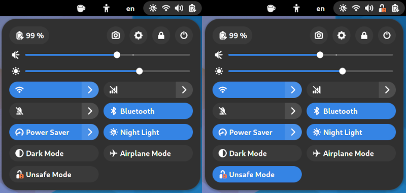
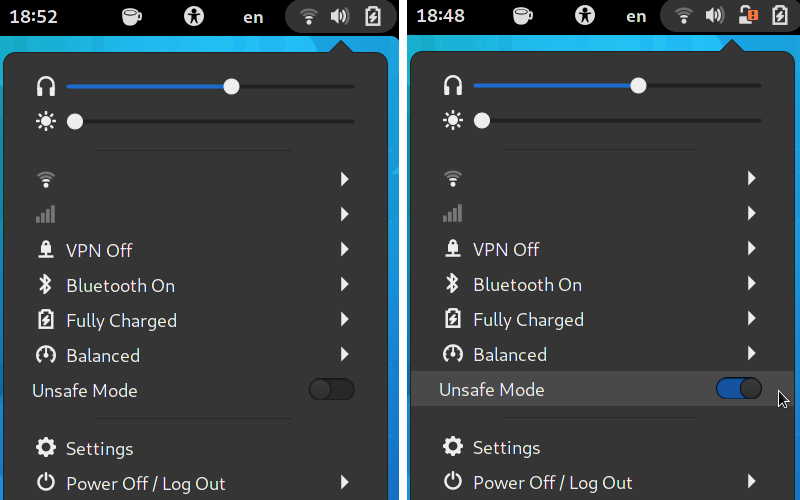

# Unsafe Mode Menu

Simple GNOME extension to change the Gnome Shell unsafe-mode via the quick
settings menu/panel menu. Currently runs on Gnome Shell 42-47 using the following
extension versions:

| Gnome Shell | Latest Version | Branch      |
|-------------|----------------|-------------|
| 45-47       | v10            | main        |
| 42-44       | v8             | gnome-42-44 |

If you want to try it on a newer version you need to add `"<version>"` to the
list of supported versions in `unsafe-mode-menu@linushdot.local/metadata.json`
before installing it. If it just works or if there are bugs with the new Gnome
Shell feel free to open an issue here and I will see if I can update the
extension.

## Install/Update

Clone this repository and copy the extension to your extensions folder.

```
git clone https://github.com/linushdot/unsafe-mode-menu.git
cd unsafe-mode-menu
mkdir -p ~/.local/share/gnome-shell/extensions/
cp -r unsafe-mode-menu@linushdot.local ~/.local/share/gnome-shell/extensions/
```

Then restart the shell and enable the extension from https://extensions.gnome.org/local/
or from `gnome-extensions-app`.
Also on this page or in the extensions app the preferences can be modified.

If you need an older version than the current one (for example version 5) clone the repository with
the following command instead and follow the rest of the steps.

```
git clone --branch v8 https://github.com/linushdot/unsafe-mode-menu.git
```

## Preferences

- Enable on Startup: enable unsafe mode when extension is enabled or when
Gnome Shell is started with the extension enabled

## Screenshot Gnome Shell 43



## Screenshot Gnome Shell 42



## Changing Unsafe Mode via dconf

With the extension enabled unsafe mode can be read and changed using `dconf`:
```
dconf read /org/gnome/shell/extensions/unsafe-mode-menu/state
dconf write /org/gnome/shell/extensions/unsafe-mode-menu/state <true|false>
```

## Use Cases

Since Gnome 41 unsafe mode is necessary to let applications access certain
[private D-Bus APIs](https://gitlab.gnome.org/GNOME/gnome-shell/-/merge_requests/1970)
of the Gnome Shell. This mostly concerns:

- API for Screenshots (also sometimes used for screen sharing):
most applications now use a
[new interface](https://flatpak.github.io/xdg-desktop-portal/) instead, but
legacy applications may need unsafe mode for this
- Calling the `org.gnome.Shell.Eval` method to execute javascript inside
Gnome Shell: This is useful for keybindings or for controlling the Gnome
Shell from a script.

An example for the latter is changing to the secondary input source using a
command:

```
gdbus call --session --dest org.gnome.Shell \
    --object-path /org/gnome/Shell \
    --method org.gnome.Shell.Eval \
    "imports.ui.status.keyboard.getInputSourceManager().inputSources[1].activate()"
```
